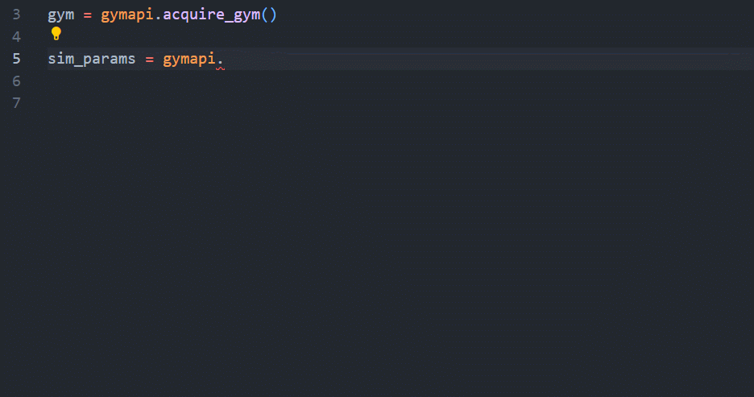
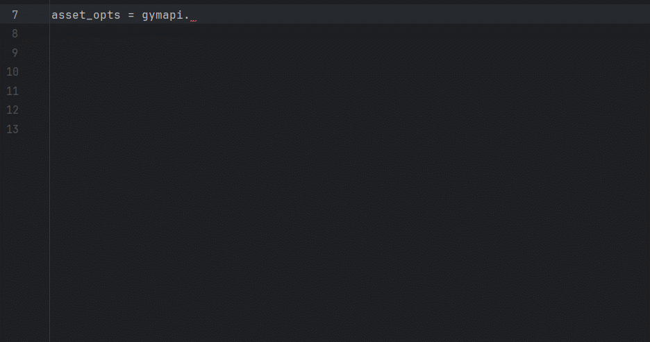

Isaac Gym Python Stubs for Code Completion

[](https://badge.fury.io/py/isaacgym-stubs)
==========================================

Enable code completion for IsaacGym simply with `pip install isaacgym-stubs`, even without IsaacGym itself!

```bash
# Install from PyPi
pip3 install isaacgym-stubs

# Alternatively, install from Github
# pip3 install git+https://github.com/yzqin/isaacgym-stubs.git
```

Begin your code with the typical `from isaacgym import gymapi` and enjoy auto-completion.

The magic of `stub` is that you even **do not need to pip install IsaacGym itself**.

For example, you may want to run IsaacGym on server but develop the code on a MacBook.
IsaacGym may not support Mac. But you can still install this repo on MacBook and get smooth code completion during
development!

### Demo

**VsCode**



**PyCharm**



### Troubleshooting

1. The Python interpreter specified in your IDE should be the Python where isaacgym-stubs is installed. For
   example, if you install this repository with conda Python but select the system Python as the interpreter in your
   IDE, you won't have any code auto-completion. Follow the official instruction
   [here](https://code.visualstudio.com/docs/python/environments) for VSCode
   and [here](https://www.jetbrains.com/help/pycharm/configuring-python-interpreter.html) for PyCharm.
2. Code auto-completion will not function if there's a directory named `issacgym` in your workspace. In this
   case, the isaacgym symbol in your import will point to the directory instead of this package, disrupting the
   auto-completion. Ensure that there's no `isaacgym` directory in your IDE workspace.
3. Depending on which IDE you are using, sometimes you may need to restart the IDE after `pip install` for re-indexing.

### Overview

This repository contains the `pyi` stub for the IsaacGym library, which can be used for code completion and type
checking.
According to the guidelines outlined in [PEP-561](https://peps.python.org/pep-0561/), Python stub files contain only
type information and no runtime code.
The `stub` in this repo is generated based on IsaacGym version `1.0rc4`.

### How to Generate This `pyi`

See [here](./STUB.md) for more explanation.

